# Key Analysis Cross-Benchmark Analysis

This report is intended to be read directly. Figures and compact table previews are embedded inline; CSV paths are listed for exact numbers and reproducibility.

## Directory Contract

- Key analysis tables: `output/key_analyses/tables/`
- Key analysis figures: `output/key_analyses/figures/`
- Layered table groups: `benchmark_level/`, `leaderboards/`, `task_level/`, `harbormix/`, and `provenance/`.
- Layered figure groups: `benchmark_level/`, `leaderboards/`, `task_level/`, and `harbormix/`.
- Leaderboard figures are further layered into `leaderboards/per_benchmark/` and `leaderboards/clustered/`; the report embeds only the clustered pages to keep reading compact.
- Intermediate study outputs: `output/intermediate_studies/`
- Intermediate imputed matrices and diagnostics: `data/processed/intermediate/`

The current preprocessing contract is task-first: task scores are filled first, then benchmark scores are aggregated from the filled task matrix. The original benchmark matrix is retained as metadata and as a sanity check, but benchmark scores are not imputed directly.

BenchPress mapping note: Dimitris's BenchPress repo treats benchmark prediction as an explicit analysis problem, compares benchmark-regression and SVD families under held-out validation, and uses a blend because regression can be more accurate while SVD gives broader coverage. Our schema is task-rich rather than model-benchmark-only, so we map that lesson by validating several task-fill families on held-out observed cells, using benchmark/task predictability tables for difficulty ranking, and keeping task aggregate alignment as a diagnostic rather than blindly trusting every aggregate.

Data provenance for the main studies:

| analysis | primary_matrix | processed_output |
| --- | --- | --- |
| coverage filtering | task-observed benchmark aggregate metadata | data/processed/intermediate/benchmark_from_task_aggregate_column_quality.csv |
| agent+model aggregate leaderboard | benchmark scores aggregated from filled task matrix | data/processed/intermediate/benchmark_from_task_aggregate_matrix.csv |
| per-benchmark mini-leaderboards | benchmark scores aggregated from filled task matrix | data/processed/intermediate/benchmark_from_task_aggregate_matrix.csv |
| model vs agent roles | benchmark-relative matrix aggregated from filled tasks | data/processed/intermediate/benchmark_from_task_aggregate_normalized_matrix.csv |
| benchmark predictability and similarity | benchmark-relative matrix aggregated from filled tasks | data/processed/intermediate/benchmark_from_task_aggregate_normalized_matrix.csv |
| terminus harness deltas | benchmark-relative matrix aggregated from filled tasks | data/processed/intermediate/benchmark_from_task_aggregate_normalized_matrix.csv |
| task similarity and representatives | filled task benchmark-relative matrix plus task quality metadata | data/processed/intermediate/task_imputed_normalized_matrix.csv |
| HaborMix candidate selection | processed task item statistics | data/processed/intermediate/task_item_stats.csv |

Preprocessing diagnostics:

Task imputation method: each score column is robustly centered and scaled after `log1p` for nonnegative unbounded columns. The pipeline compares column-median, row-mean shrinkage, two-way shrinkage, and low-rank iterative SVD candidates on held-out observed cells, then uses the lowest-MAE method. For this run the selected task imputer is `column_median` with rank 0. Observed task cells are restored exactly; filled task scores are inverse-transformed and clipped to the observed range of that task. Benchmark scores are then calculated as per-benchmark means across those task scores. Task-level imputation remains less stable than dense benchmark tables because the task matrix is much wider and sparser, so task conclusions are restricted to reliable bounded non-degenerate tasks.

| matrix | preprocessing_method | selected_imputation_method | missing_fraction_before_processing | selected_imputation_rank | task_imputation_method_used_for_benchmark_aggregation | task_imputation_rank_used_for_benchmark_aggregation | holdout_cells | holdout_rmse_scaled_score_space | holdout_mae_scaled_score_space |
| --- | --- | --- | --- | --- | --- | --- | --- | --- | --- |
| benchmark | task_imputation_then_benchmark_aggregate |  | 0.243 |  | column_median | 0.000 | 0 |  |  |
| task | column_median | column_median | 0.618 | 0.000 |  |  | 4325 | 13.196 | 0.739 |

Held-out task imputation comparison:

| method | rank | holdout_cells | rmse | mae |
| --- | --- | --- | --- | --- |
| column_median | 0 | 4325 | 13.196 | 0.739 |
| row_mean_shrunk | 0 | 4325 | 13.156 | 0.756 |
| iterative_svd | 2 | 4325 | 10.269 | 0.806 |
| two_way_shrunk | 0 | 4325 | 14.487 | 1.068 |

Interpretation: the task matrix is sparse and very wide, so this is a validation-backed fill, not ground truth. The aggregate benchmark table is more stable than individual filled cells because it averages over many task columns, but sparse benchmarks should still be read with their task-cell missingness fields.

Reliability conclusion: SVD is not automatically the right fill here. In this run, low-rank SVD improves RMSE because it reduces a few large scaled errors, but it loses on MAE, which is the better primary criterion for this mixed-scale sparse matrix because many robust-normalized task columns have outlier-sensitive tails. The selected column-median fill is therefore intentionally conservative: it preserves each task's observed center and avoids hallucinating row-level structure where the held-out cells do not support it.

## Research Question Coverage Checklist

| Question | Status | Main artifacts |
| --- | --- | --- |
| Agent vs model role overall and per benchmark | covered | `tables/benchmark_level/benchmark_variance_decomposition_filtered.csv`, `tables/benchmark_level/benchmark_model_agent_role_by_benchmark.csv`, `figures/benchmark_level/benchmark_model_vs_agent_role.png` |
| BenchPress-style benchmark predictability and hard-to-predict benchmarks/tasks | covered | `tables/benchmark_level/benchmark_uniqueness_filtered.csv`, `tables/task_level/task_predictability_ranked.csv`, benchmark/task predictability figures |
| Benchmark/task similarity and clustering | covered | `tables/benchmark_level/benchmark_similarity_clusters.csv`, `tables/task_level/task_cross_benchmark_similarity.csv`, clustered heatmaps |
| Representative tasks per benchmark | covered | `tables/task_level/task_representative_tasks.csv`, `figures/task_level/task_best_representatives.png` |
| Mini-leaderboards grouped by similar benchmarks | covered | `tables/leaderboards/benchmark_mini_leaderboards.csv`, `figures/leaderboards/clustered/mini_leaderboards_cluster_*.png` |
| Agent harness improvements over Terminus | covered | `tables/benchmark_level/benchmark_agent_lift_vs_terminus.csv`, `tables/benchmark_level/terminus_delta_by_model.csv`, Terminus heatmaps |
| Quantitative HaborMix task selection | covered | `tables/harbormix/harbormix_selected_tasks.csv`, `tables/harbormix/harbormix_selection_by_benchmark.csv`, `figures/harbormix/harbormix_selection_diagnostics.png` |

## Study 1: Coverage Filtering

**Method:** Benchmark-level claims use benchmark aggregates derived from the filled task matrix, but coverage filtering still uses evidence metadata: at least 15 agent+model rows need some observed task evidence for that benchmark, and the missingness fields describe coverage before task filling. This filter keeps the key analysis story from leaning too heavily on filled task values.

**Code files:**
- `src/habor_mix_analyzer/core/`
- `src/habor_mix_analyzer/preprocessing/svd_imputation.py`
- `src/habor_mix_analyzer/studies/coverage_filtering.py`
- `src/habor_mix_analyzer/studies/intermediate_tables.py`
- `src/habor_mix_analyzer/studies/model_agent_roles.py`
- `src/habor_mix_analyzer/studies/benchmark_predictability.py`
- `src/habor_mix_analyzer/studies/benchmark_similarity.py`
- `src/habor_mix_analyzer/studies/leaderboards.py`
- `src/habor_mix_analyzer/studies/terminus_comparison.py`
- `src/habor_mix_analyzer/studies/task_alignment.py`
- `src/habor_mix_analyzer/studies/task_selection.py`
- `src/habor_mix_analyzer/studies/task_similarity.py`
- `src/habor_mix_analyzer/studies/provenance.py`
- `src/habor_mix_analyzer/visualization/`
- `src/habor_mix_analyzer/reporting/key_analysis_report.py`
- `src/habor_mix_analyzer/cli.py`

**Result paths:**
- `output/key_analyses/tables/benchmark_level/benchmark_filtering.csv`

**Result overview and analysis:**
- Included 40 of 45 benchmarks.
- Excluded sparse benchmarks: quixbugs, skillsbench, hle, financeagent, ds-1000.
- Benchmark scores are task aggregates, not direct benchmark-imputation outputs; pre-aggregation benchmark missing fraction was 0.243.

| benchmark | include_in_key_analysis | observed_count | missing_fraction | task_cell_missing_fraction |
| --- | --- | --- | --- | --- |
| aider-polyglot | True | 26 | 0.000 | 0.044 |
| algotune | True | 26 | 0.000 | 0.131 |
| bfcl | True | 26 | 0.000 | 0.000 |
| bigcodebench | True | 26 | 0.000 | 0.559 |
| crustbench | True | 26 | 0.000 | 0.117 |
| featurebench-modal | True | 26 | 0.000 | 0.052 |
| gaia | True | 26 | 0.000 | 0.206 |
| lawbench | True | 26 | 0.000 | 0.409 |
| omnimath | True | 26 | 0.000 | 0.770 |
| seal0 | True | 26 | 0.000 | 0.002 |
| spider2 | True | 26 | 0.000 | 0.396 |
| swtbench | True | 26 | 0.000 | 0.494 |

**Insight and findings:** Sparse columns should stay in appendix/provisional analysis until more experiments land. The main key analysis story should use the coverage-filtered benchmark set.

## Study 2: Model vs Agent Roles

**Method:** I fit fixed-effect regressions in two views. The overall view decomposes benchmark-relative score into model, agent, benchmark, and interaction terms. The per-benchmark view fits each benchmark separately and compares partial R2 from model after controlling for agent against partial R2 from agent after controlling for model.

**Code files:**
- `src/habor_mix_analyzer/core/`
- `src/habor_mix_analyzer/preprocessing/svd_imputation.py`
- `src/habor_mix_analyzer/studies/coverage_filtering.py`
- `src/habor_mix_analyzer/studies/intermediate_tables.py`
- `src/habor_mix_analyzer/studies/model_agent_roles.py`
- `src/habor_mix_analyzer/studies/benchmark_predictability.py`
- `src/habor_mix_analyzer/studies/benchmark_similarity.py`
- `src/habor_mix_analyzer/studies/leaderboards.py`
- `src/habor_mix_analyzer/studies/terminus_comparison.py`
- `src/habor_mix_analyzer/studies/task_alignment.py`
- `src/habor_mix_analyzer/studies/task_selection.py`
- `src/habor_mix_analyzer/studies/task_similarity.py`
- `src/habor_mix_analyzer/studies/provenance.py`
- `src/habor_mix_analyzer/visualization/`
- `src/habor_mix_analyzer/reporting/key_analysis_report.py`
- `src/habor_mix_analyzer/cli.py`

**Result paths:**
- `output/key_analyses/tables/benchmark_level/benchmark_variance_decomposition_filtered.csv`
- `output/key_analyses/tables/benchmark_level/benchmark_model_agent_role_by_benchmark.csv`
- `output/key_analyses/tables/benchmark_level/benchmark_model_adjusted_effects.csv`
- `output/key_analyses/tables/benchmark_level/benchmark_agent_adjusted_effects.csv`

**Result overview and analysis:**
| component | partial_r2_over_other_main_effects | r2 | type |
| --- | --- | --- | --- |
| all_main_effects | 0.712 | 0.712 | combined |
| benchmark | 0.602 | 0.602 | main_effect |
| model:benchmark | 0.189 | 0.901 | interaction_increment |
| model | 0.094 | 0.101 | main_effect |
| agent:benchmark | 0.073 | 0.786 | interaction_increment |
| agent | 0.009 | 0.016 | main_effect |
| model:agent | 0.008 | 0.721 | interaction_increment |

Benchmarks with the largest model-vs-agent role imbalance:
| benchmark | model_partial_r2_over_agent | agent_partial_r2_over_model | dominant_dimension |
| --- | --- | --- | --- |
| kumo | 0.857 | 0.038 | model |
| qcircuitbench | 0.834 | 0.019 | model |
| sldbench | 0.827 | 0.013 | model |
| aider-polyglot | 0.841 | 0.031 | model |
| livecodebench | 0.792 | 0.004 | model |
| strongreject | 0.908 | 0.142 | model |
| swe-lancer | 0.768 | 0.011 | model |
| algotune | 0.778 | 0.022 | model |
| bfcl | 0.732 | 0.022 | model |
| gpqa-diamond | 0.801 | 0.092 | model |

**Insight and findings:** Model identity explains much more overall variation than agent identity, but the role varies by benchmark. Agent effects are more useful as benchmark-specific harnessing effects than as a universal main effect.

## Study 3: Agent+Model Leaderboards

**Method:** I keep `agent+model` rankings as descriptive mini-leaderboards. Per-benchmark mini-leaderboards use benchmark scores aggregated from filled tasks on each benchmark's original metric scale. Each mini-leaderboard shows all available agent+model rows, grouped by model with colored bars for agents, so the same plot makes model differences and agent harness differences visible. The aggregate top-agent plot uses mean within-benchmark score percentile, because averaging scores across benchmarks with different scales would be misleading.

**Code files:**
- `src/habor_mix_analyzer/core/`
- `src/habor_mix_analyzer/preprocessing/svd_imputation.py`
- `src/habor_mix_analyzer/studies/coverage_filtering.py`
- `src/habor_mix_analyzer/studies/intermediate_tables.py`
- `src/habor_mix_analyzer/studies/model_agent_roles.py`
- `src/habor_mix_analyzer/studies/benchmark_predictability.py`
- `src/habor_mix_analyzer/studies/benchmark_similarity.py`
- `src/habor_mix_analyzer/studies/leaderboards.py`
- `src/habor_mix_analyzer/studies/terminus_comparison.py`
- `src/habor_mix_analyzer/studies/task_alignment.py`
- `src/habor_mix_analyzer/studies/task_selection.py`
- `src/habor_mix_analyzer/studies/task_similarity.py`
- `src/habor_mix_analyzer/studies/provenance.py`
- `src/habor_mix_analyzer/visualization/`
- `src/habor_mix_analyzer/reporting/key_analysis_report.py`
- `src/habor_mix_analyzer/cli.py`

**Result paths:**
- `output/key_analyses/tables/leaderboards/benchmark_agent_model_scores.csv`
- `output/key_analyses/tables/leaderboards/benchmark_scores_long.csv`
- `output/key_analyses/tables/leaderboards/benchmark_mini_leaderboards.csv`
- `output/key_analyses/tables/benchmark_level/benchmark_similarity_clusters.csv`
- `output/key_analyses/figures/leaderboards/clustered/mini_leaderboards_cluster_*.png`
- `output/key_analyses/figures/leaderboards/per_benchmark/mini_leaderboard_*.png`

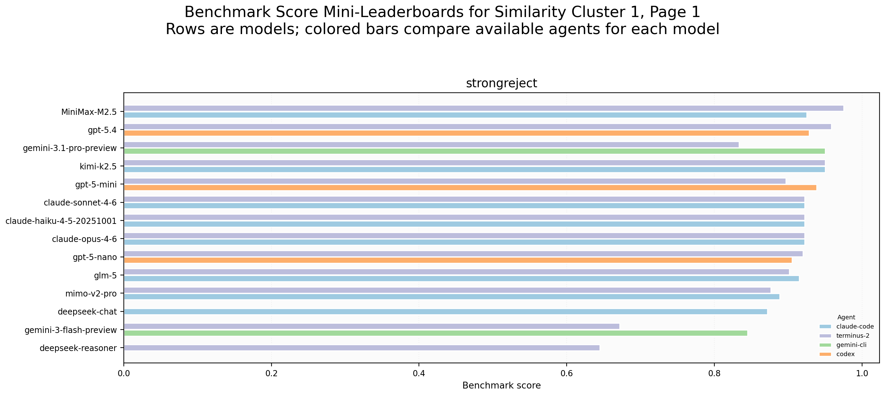
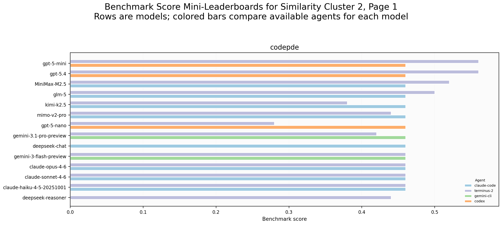
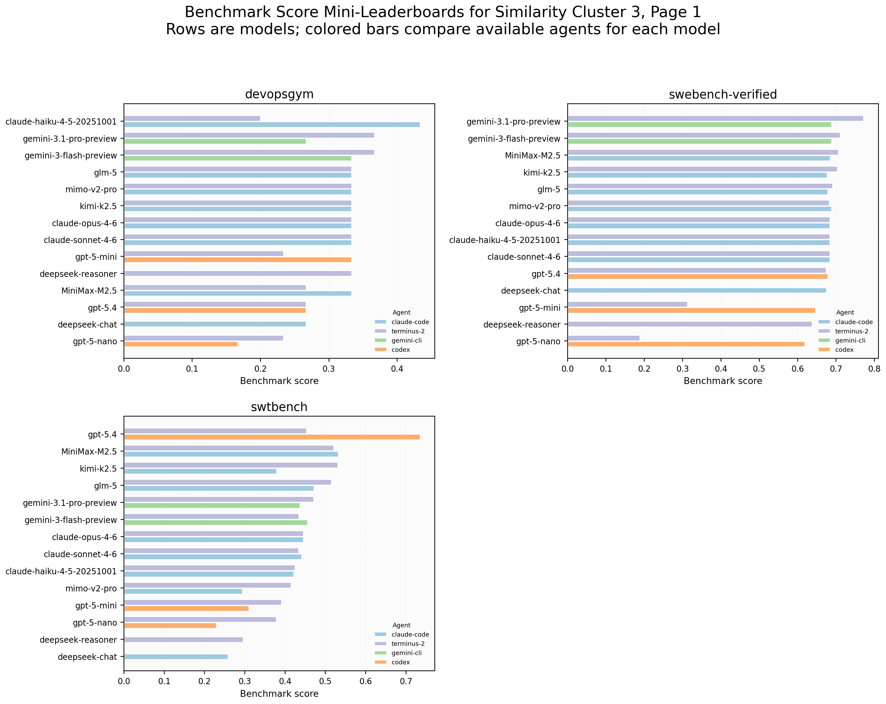
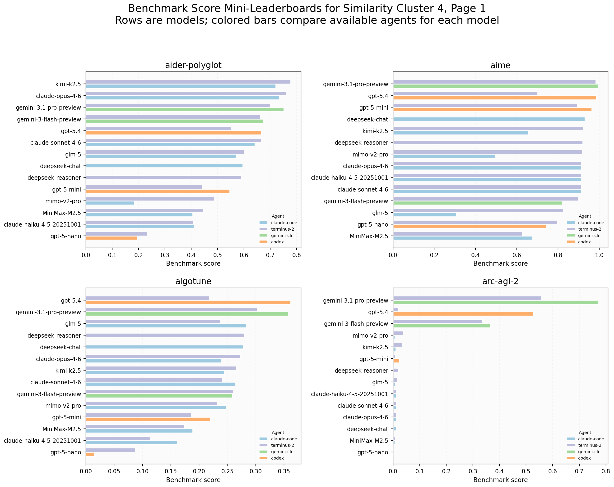
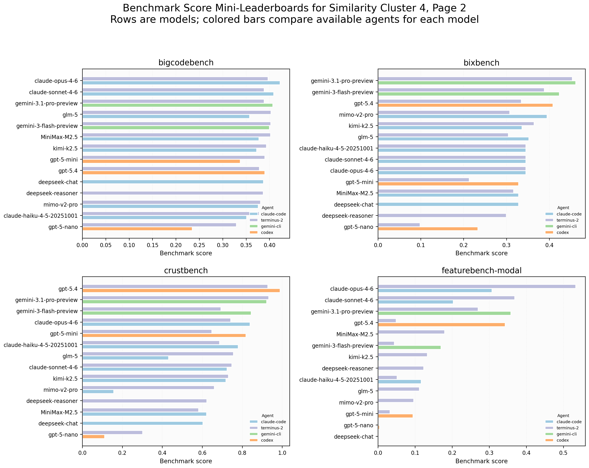
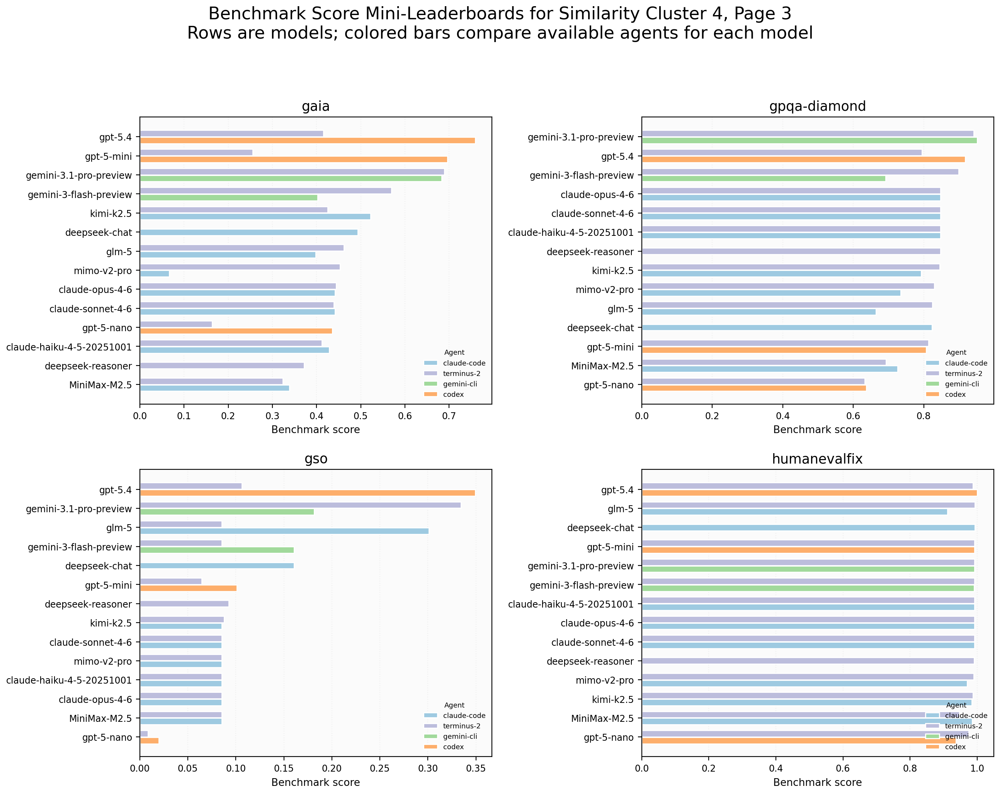
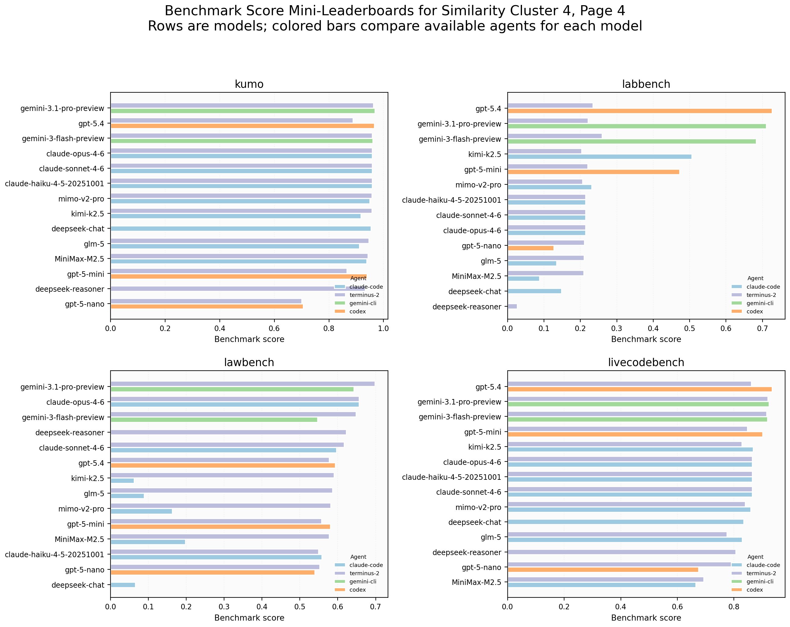
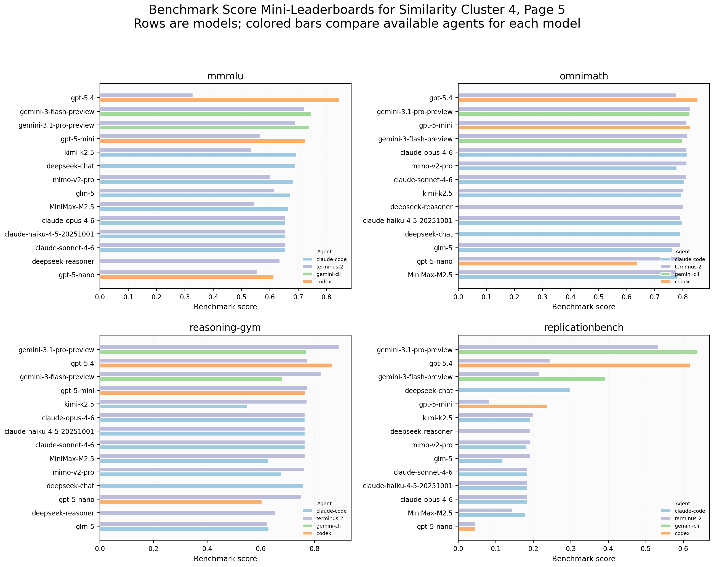
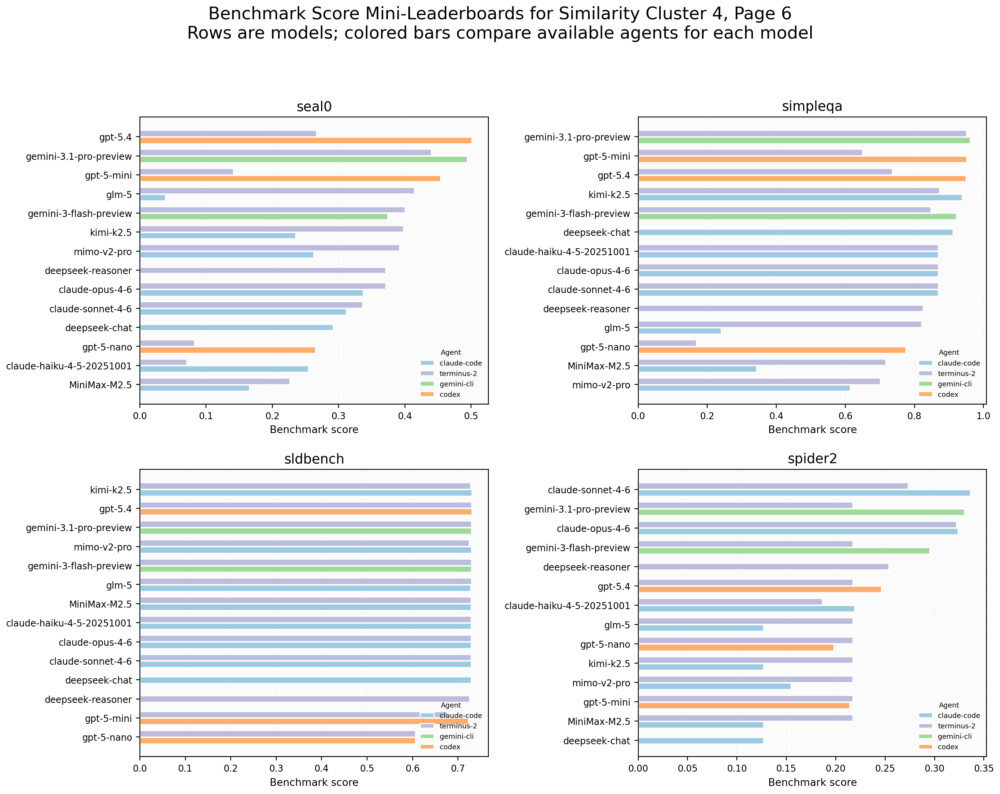
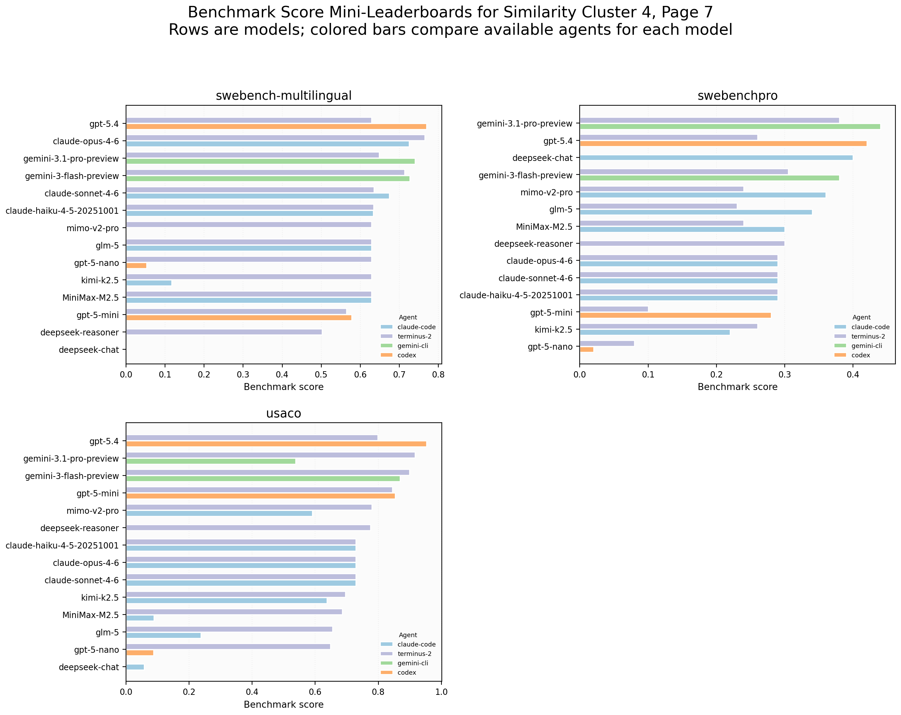
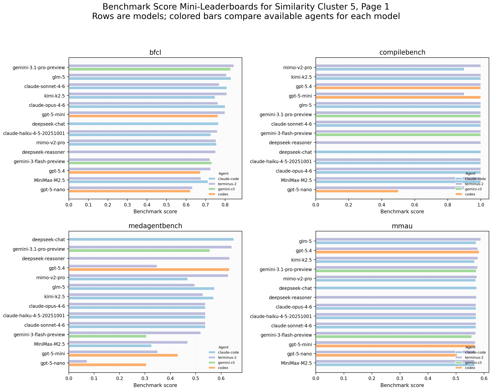
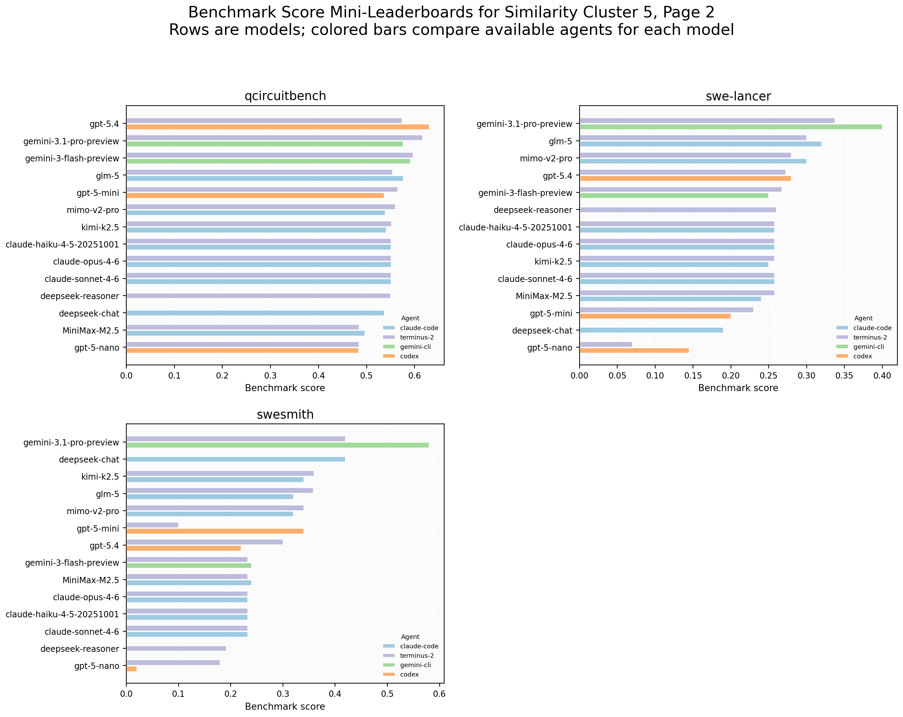
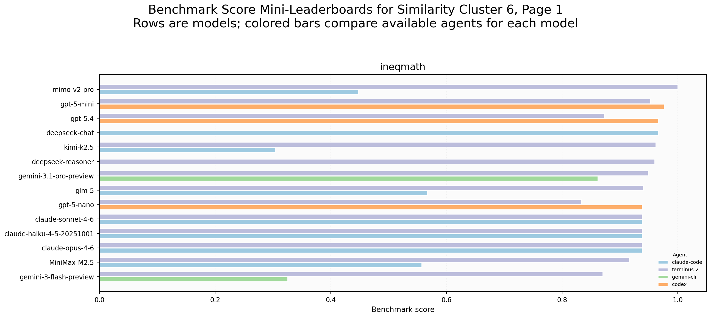

**Result overview and analysis:**
| rank | agent_model | mean_score_percentile_across_benchmarks | original_benchmark_table_coverage |
| --- | --- | --- | --- |
| 1 | codex + gpt-5.4 | 0.836 | 0.500 |
| 2 | terminus-2 + gemini-3.1-pro-preview | 0.834 | 0.450 |
| 3 | gemini-cli + gemini-3.1-pro-preview | 0.832 | 0.450 |
| 4 | terminus-2 + gemini-3-flash-preview | 0.659 | 0.500 |
| 5 | terminus-2 + claude-opus-4-6 | 0.627 | 0.075 |
| 6 | claude-code + claude-opus-4-6 | 0.626 | 0.050 |
| 7 | gemini-cli + gemini-3-flash-preview | 0.618 | 0.425 |
| 8 | terminus-2 + kimi-k2.5 | 0.609 | 0.400 |
| 9 | claude-code + claude-sonnet-4-6 | 0.605 | 0.050 |
| 10 | terminus-2 + claude-sonnet-4-6 | 0.587 | 0.075 |

**Insight and findings:** Benchmark scores should be read benchmark by benchmark. The percentile aggregate is a compact descriptive ranking only; it is not a causal agent claim because model and agent are entangled in the row identity.

## Study 4: Benchmark Predictability and Similarity

**Method:** Following the BenchPress idea, each included benchmark is predicted from the other included benchmarks using ridge regression with cross-validation over agent+model rows. Low or negative R2 means the benchmark is hard to reconstruct from the rest and likely contributes distinct information. Benchmark similarity uses same-dimensional vectors: every benchmark is represented by its score profile across the same agent+model rows, and clustering is run on `1 - |Spearman correlation|` so benchmarks with similar ranking behavior sit together even if one is directionally inverted.

**Code files:**
- `src/habor_mix_analyzer/core/`
- `src/habor_mix_analyzer/preprocessing/svd_imputation.py`
- `src/habor_mix_analyzer/studies/coverage_filtering.py`
- `src/habor_mix_analyzer/studies/intermediate_tables.py`
- `src/habor_mix_analyzer/studies/model_agent_roles.py`
- `src/habor_mix_analyzer/studies/benchmark_predictability.py`
- `src/habor_mix_analyzer/studies/benchmark_similarity.py`
- `src/habor_mix_analyzer/studies/leaderboards.py`
- `src/habor_mix_analyzer/studies/terminus_comparison.py`
- `src/habor_mix_analyzer/studies/task_alignment.py`
- `src/habor_mix_analyzer/studies/task_selection.py`
- `src/habor_mix_analyzer/studies/task_similarity.py`
- `src/habor_mix_analyzer/studies/provenance.py`
- `src/habor_mix_analyzer/visualization/`
- `src/habor_mix_analyzer/reporting/key_analysis_report.py`
- `src/habor_mix_analyzer/cli.py`

**Result paths:**
- `output/key_analyses/tables/benchmark_level/benchmark_uniqueness_filtered.csv`
- `output/key_analyses/tables/benchmark_level/benchmark_redundancy_pairs_filtered.csv`
- `output/key_analyses/tables/benchmark_level/benchmark_correlation_clustered.csv`

**Result overview and analysis:**
Hardest-to-predict benchmarks:
| benchmark | cv_r2_from_other_included_benchmarks | cv_rmse |
| --- | --- | --- |
| bigcodebench | -0.435 | 0.593 |
| codepde | -0.305 | 0.131 |
| strongreject | -0.300 | 1.310 |
| bfcl | -0.265 | 0.855 |
| mmau | -0.207 | 0.285 |
| swtbench | -0.184 | 0.345 |
| swebench-verified | -0.174 | 1.618 |
| swebench-multilingual | -0.082 | 0.766 |
| compilebench | -0.043 | 0.909 |
| humanevalfix | -0.043 | 1.062 |

Most similar benchmark pairs:
| left | right | spearman |
| --- | --- | --- |
| arc-agi-2 | replicationbench | 0.875 |
| labbench | livecodebench | 0.869 |
| featurebench-modal | spider2 | 0.856 |
| seal0 | arc-agi-2 | 0.847 |
| featurebench-modal | lawbench | 0.801 |
| crustbench | arc-agi-2 | 0.790 |
| omnimath | aime | 0.789 |
| kumo | swebench-multilingual | 0.783 |
| gpqa-diamond | kumo | 0.774 |
| seal0 | replicationbench | 0.774 |

**Insight and findings:** Predictable benchmarks are candidates for compression; hard-to-predict benchmarks should be preserved when the goal is behavioral breadth. Similarity clusters are also the basis for the grouped mini-leaderboards.

Paper-facing read: the least reconstructable benchmark set starts with bigcodebench, codepde, strongreject, bfcl, mmau. These are the strongest candidates to preserve when reducing the suite because other benchmark scores do not explain them well. In contrast, the most predictable benchmarks start with bixbench, sldbench, replicationbench, lawbench, arc-agi-2; these are not useless, but they are where compression or cluster-level reporting is easiest to justify.

## Study 5: Task Similarity, Predictability, and Representatives

**Method:** Task-level analysis uses reliable, bounded, non-degenerate tasks only. Task similarity also uses same-dimensional vectors: every task is represented by its filled, standardized score profile across the same agent+model rows. A task is hard to predict when its maximum absolute profile correlation to peer tasks in the same benchmark is low. Representativeness is no longer pure correlation with the benchmark aggregate: I compute a leave-one-out aggregate correlation and multiply it by observed cross-agent/model variance, so redundant but low-discrimination tasks no longer dominate. Within- and cross-benchmark task similarity use median absolute task-profile correlations, with at most the most discriminative 40 tasks sampled per benchmark for cross-benchmark pair summaries. Difficulty tiers use mean task score thresholds: frontier <5%, hard 5-30%, medium 30-70%, easy 70-95%, saturated >95%.

**Code files:**
- `src/habor_mix_analyzer/core/`
- `src/habor_mix_analyzer/preprocessing/svd_imputation.py`
- `src/habor_mix_analyzer/studies/coverage_filtering.py`
- `src/habor_mix_analyzer/studies/intermediate_tables.py`
- `src/habor_mix_analyzer/studies/model_agent_roles.py`
- `src/habor_mix_analyzer/studies/benchmark_predictability.py`
- `src/habor_mix_analyzer/studies/benchmark_similarity.py`
- `src/habor_mix_analyzer/studies/leaderboards.py`
- `src/habor_mix_analyzer/studies/terminus_comparison.py`
- `src/habor_mix_analyzer/studies/task_alignment.py`
- `src/habor_mix_analyzer/studies/task_selection.py`
- `src/habor_mix_analyzer/studies/task_similarity.py`
- `src/habor_mix_analyzer/studies/provenance.py`
- `src/habor_mix_analyzer/visualization/`
- `src/habor_mix_analyzer/reporting/key_analysis_report.py`
- `src/habor_mix_analyzer/cli.py`

**Result paths:**
- `output/key_analyses/tables/task_level/task_predictability_ranked.csv`
- `output/key_analyses/tables/task_level/task_representative_tasks.csv`
- `output/key_analyses/tables/task_level/task_within_benchmark_similarity.csv`
- `output/key_analyses/tables/task_level/task_cross_benchmark_similarity.csv`

**Result overview and analysis:**
Hardest-to-predict reliable tasks:
| benchmark | task_id | task_unpredictability_score | difficulty_tier | task_score |
| --- | --- | --- | --- | --- |
| humanevalfix | humanevalfix-python-6 | 0.920 | saturated | 0.962 |
| devopsgym | devopsgym-codegen__prometheus__prometheus-7667 | 0.915 | easy | 0.846 |
| gso | gso-pydantic--pydantic-addf1f9 | 0.829 | frontier | 0.019 |
| swebench-verified | swebench-verified-matplotlib__matplotlib-26208 | 0.756 | frontier | 0.023 |
| gso | gso-huggingface--transformers-253f9a3 | 0.727 | medium | 0.590 |
| strongreject | strongreject_sexual_content_0005_pap_logical_appeal | 0.712 | saturated | 0.980 |
| devopsgym | devopsgym-testgen__spotbugs__spotbugs-2795 | 0.700 | medium | 0.692 |
| devopsgym | devopsgym-codegen__containerd__containerd-10275 | 0.700 | frontier | 0.038 |
| swesmith | swesmith-oauthlib__oauthlib.1fd52536.combine_file__5wgd819s | 0.683 | medium | 0.348 |
| bixbench | bix-10-q5 | 0.655 | hard | 0.077 |
| bigcodebench | bigcodebench_492 | 0.635 | hard | 0.231 |
| swe-lancer | swe-lancer-43022-manager-0 | 0.631 | hard | 0.102 |

Most representative tasks:
| benchmark | task_id | useful_representativeness_score | representativeness_score | difficulty_tier | task_score |
| --- | --- | --- | --- | --- | --- |
| swebench-multilingual | swebench-multilingual-php-cs-fixer__php-cs-fixer-7523 | 0.441 | 0.957 | easy | 0.846 |
| swebench-multilingual | swebench-multilingual-jqlang__jq-2658 | 0.441 | 0.957 | easy | 0.846 |
| swebench-multilingual | swebench-multilingual-caddyserver__caddy-6288 | 0.441 | 0.957 | easy | 0.846 |
| swebench-multilingual | swebench-multilingual-fmtlib__fmt-3729 | 0.441 | 0.957 | easy | 0.846 |
| labbench | labbench-figqa-0036 | 0.436 | 0.930 | hard | 0.185 |
| lawbench | lawbench-3-7-11-zero-shot | 0.436 | 0.966 | easy | 0.783 |
| labbench | labbench-figqa-0128 | 0.433 | 0.932 | medium | 0.323 |
| swebench-multilingual | swebench-multilingual-jqlang__jq-2919 | 0.432 | 0.957 | easy | 0.846 |
| swebench-multilingual | swebench-multilingual-fluent__fluentd-3917 | 0.432 | 0.957 | easy | 0.846 |
| swebench-multilingual | swebench-multilingual-php-cs-fixer__php-cs-fixer-8256 | 0.432 | 0.957 | easy | 0.846 |
| swebench-multilingual | swebench-multilingual-tokio-rs__tokio-7139 | 0.432 | 0.957 | easy | 0.846 |
| swebench-multilingual | swebench-multilingual-briannesbitt__carbon-3103 | 0.432 | 0.957 | easy | 0.846 |

Benchmarks with strongest within-benchmark task similarity:
| benchmark | n_reliable_tasks | median_abs_task_similarity_within_benchmark |
| --- | --- | --- |
| lawbench | 180 | 0.809 |
| arc-agi-2 | 94 | 0.794 |
| usaco | 91 | 0.666 |
| ineqmath | 21 | 0.643 |
| swebench-verified | 9 | 0.641 |
| simpleqa | 200 | 0.595 |
| medagentbench | 71 | 0.534 |
| compilebench | 2 | 0.525 |
| labbench | 180 | 0.501 |
| swebench-multilingual | 255 | 0.484 |

**Insight and findings:** Task predictability and useful representativeness are different objectives. Representative tasks are the base set for predicting benchmark aggregates; hard-to-predict and difficult tasks are additional stress tests for broad coverage.

Paper-facing read: the hardest-to-predict task examples begin with humanevalfix/humanevalfix-python-6, devopsgym/devopsgym-codegen__prometheus__prometheus-7667, gso/gso-pydantic--pydantic-addf1f9. The most useful representative task examples begin with swebench-multilingual/swebench-multilingual-php-cs-fixer__php-cs-fixer-7523, swebench-multilingual/swebench-multilingual-jqlang__jq-2658, swebench-multilingual/swebench-multilingual-caddyserver__caddy-6288. That split is the main reason HaborMix should not be selected from one scalar alone: a task can be representative without being unique, and a unique task can be too idiosyncratic to stand in for its benchmark.

## Study 6: Terminus Harnessing Effects

**Method:** Terminus is treated as the fair baseline across models. For every model with both `terminus-2` and another agent row, I compute paired benchmark-relative score deltas while holding the model fixed.

**Code files:**
- `src/habor_mix_analyzer/core/`
- `src/habor_mix_analyzer/preprocessing/svd_imputation.py`
- `src/habor_mix_analyzer/studies/coverage_filtering.py`
- `src/habor_mix_analyzer/studies/intermediate_tables.py`
- `src/habor_mix_analyzer/studies/model_agent_roles.py`
- `src/habor_mix_analyzer/studies/benchmark_predictability.py`
- `src/habor_mix_analyzer/studies/benchmark_similarity.py`
- `src/habor_mix_analyzer/studies/leaderboards.py`
- `src/habor_mix_analyzer/studies/terminus_comparison.py`
- `src/habor_mix_analyzer/studies/task_alignment.py`
- `src/habor_mix_analyzer/studies/task_selection.py`
- `src/habor_mix_analyzer/studies/task_similarity.py`
- `src/habor_mix_analyzer/studies/provenance.py`
- `src/habor_mix_analyzer/visualization/`
- `src/habor_mix_analyzer/reporting/key_analysis_report.py`
- `src/habor_mix_analyzer/cli.py`

**Result paths:**
- `output/key_analyses/tables/benchmark_level/benchmark_agent_lift_vs_terminus.csv`
- `output/key_analyses/tables/benchmark_level/terminus_delta_by_model.csv`
- `output/intermediate_studies/benchmark_level/benchmark_agent_lift_by_benchmark.csv`

**Result overview and analysis:**
| agent | mean_delta_vs_terminus | win_rate_vs_terminus | compared_models |
| --- | --- | --- | --- |
| codex | 0.420 | 0.642 | 3 |
| gemini-cli | 0.097 | 0.512 | 2 |
| claude-code | -0.183 | 0.254 | 7 |

| model | agent | mean_delta_vs_terminus | win_rate_vs_terminus |
| --- | --- | --- | --- |
| gpt-5.4 | codex | 0.808 | 0.850 |
| gpt-5-mini | codex | 0.547 | 0.725 |
| gemini-3.1-pro-preview | gemini-cli | 0.170 | 0.550 |
| claude-haiku-4-5-20251001 | claude-code | 0.064 | 0.250 |
| gemini-3-flash-preview | gemini-cli | 0.024 | 0.475 |
| claude-sonnet-4-6 | claude-code | 0.005 | 0.175 |
| claude-opus-4-6 | claude-code | -0.017 | 0.125 |
| gpt-5-nano | codex | -0.096 | 0.350 |
| MiniMax-M2.5 | claude-code | -0.162 | 0.425 |
| kimi-k2.5 | claude-code | -0.301 | 0.200 |
| mimo-v2-pro | claude-code | -0.410 | 0.300 |
| glm-5 | claude-code | -0.458 | 0.300 |

**Insight and findings:** Paired deltas are the best current evidence for whether an agent harness improves over Terminus. The deltas vary by model and benchmark, so claims should avoid saying one harness universally dominates.

## Study 7: HaborMix Selection

**Method:** Candidate tasks must be reliable and bounded. The final HaborMix selection targets a compact 100-200 task set, currently 160 tasks. It first includes a small base set of useful representative tasks per benchmark, then fills the remaining slots with a diversity-aware ranking over difficult, frontier-with-variance, unique/unpredictable, and high-composite tasks. The composite score combines useful representativeness, difficulty, unique/unpredictable signal, and cross-agent/model discrimination; it no longer excludes frontier or saturated items by construction. The broader scored pool is retained under intermediate studies for auditability.

**Code files:**
- `src/habor_mix_analyzer/core/`
- `src/habor_mix_analyzer/preprocessing/svd_imputation.py`
- `src/habor_mix_analyzer/studies/coverage_filtering.py`
- `src/habor_mix_analyzer/studies/intermediate_tables.py`
- `src/habor_mix_analyzer/studies/model_agent_roles.py`
- `src/habor_mix_analyzer/studies/benchmark_predictability.py`
- `src/habor_mix_analyzer/studies/benchmark_similarity.py`
- `src/habor_mix_analyzer/studies/leaderboards.py`
- `src/habor_mix_analyzer/studies/terminus_comparison.py`
- `src/habor_mix_analyzer/studies/task_alignment.py`
- `src/habor_mix_analyzer/studies/task_selection.py`
- `src/habor_mix_analyzer/studies/task_similarity.py`
- `src/habor_mix_analyzer/studies/provenance.py`
- `src/habor_mix_analyzer/visualization/`
- `src/habor_mix_analyzer/reporting/key_analysis_report.py`
- `src/habor_mix_analyzer/cli.py`

**Result paths:**
- `output/key_analyses/tables/harbormix/harbormix_selected_tasks.csv`
- `output/key_analyses/tables/harbormix/harbormix_selection_by_benchmark.csv`
- `output/intermediate_studies/task_level/harbormix_scored_task_pool.csv`
- `output/intermediate_studies/task_level/task_frontier_or_saturated_watchlist.csv`

**Result overview and analysis:**
| benchmark | difficulty_tier | selected_tasks | mean_selection_score | mean_representative_signal | mean_unique_unpredictable_signal | mean_difficulty_signal |
| --- | --- | --- | --- | --- | --- | --- |
| arc-agi-2 | hard | 4 | 0.809 | 0.949 | 0.533 | 0.810 |
| replicationbench | hard | 4 | 0.776 | 0.878 | 0.558 | 0.772 |
| aider-polyglot | medium | 4 | 0.738 | 0.914 | 0.609 | 0.529 |
| humanevalfix | easy | 4 | 0.689 | 0.929 | 0.814 | 0.081 |
| featurebench-modal | hard | 3 | 0.822 | 0.962 | 0.682 | 0.735 |
| livecodebench | medium | 3 | 0.811 | 0.902 | 0.882 | 0.526 |
| algotune | hard | 3 | 0.795 | 0.733 | 0.791 | 0.827 |
| spider2 | medium | 3 | 0.775 | 0.958 | 0.667 | 0.568 |
| mmmlu | hard | 3 | 0.765 | 0.636 | 0.871 | 0.801 |
| bixbench | medium | 3 | 0.760 | 0.877 | 0.763 | 0.462 |
| reasoning-gym | medium | 3 | 0.750 | 0.886 | 0.734 | 0.504 |
| labbench | hard | 3 | 0.735 | 0.948 | 0.254 | 0.787 |
| omnimath | medium | 3 | 0.726 | 0.860 | 0.772 | 0.475 |
| medagentbench | medium | 3 | 0.716 | 0.906 | 0.638 | 0.397 |

- Selected 160 final HaborMix tasks from the broader scored candidate pool.

**Insight and findings:** HaborMix selection is quantitative and auditable: representative tasks anchor the minimal benchmark-prediction base, while difficult and unique/unpredictable tasks add breadth.

Paper-facing read: the final 160-task set is intentionally not just a hard-task list. Its difficulty composition is medium: 68, easy: 42, hard: 40, frontier: 8, saturated: 2. The base representative set keeps each included benchmark anchored to its aggregate behavior, while the diversity-aware fill adds difficult, frontier, and uniquely informative items.

## Study 8: Task Aggregate vs Benchmark-Level Score Alignment

**Method:** For each benchmark, I average benchmark-relative task scores and correlate that aggregate with the benchmark-level benchmark-relative score across agent+model rows. This is intentionally diagnostic rather than a hard gate: the new benchmark score is already the task aggregate, so this table mainly identifies benchmarks where reliable bounded tasks alone do or do not track the full task-derived benchmark aggregate.

**Code files:**
- `src/habor_mix_analyzer/core/`
- `src/habor_mix_analyzer/preprocessing/svd_imputation.py`
- `src/habor_mix_analyzer/studies/coverage_filtering.py`
- `src/habor_mix_analyzer/studies/intermediate_tables.py`
- `src/habor_mix_analyzer/studies/model_agent_roles.py`
- `src/habor_mix_analyzer/studies/benchmark_predictability.py`
- `src/habor_mix_analyzer/studies/benchmark_similarity.py`
- `src/habor_mix_analyzer/studies/leaderboards.py`
- `src/habor_mix_analyzer/studies/terminus_comparison.py`
- `src/habor_mix_analyzer/studies/task_alignment.py`
- `src/habor_mix_analyzer/studies/task_selection.py`
- `src/habor_mix_analyzer/studies/task_similarity.py`
- `src/habor_mix_analyzer/studies/provenance.py`
- `src/habor_mix_analyzer/visualization/`
- `src/habor_mix_analyzer/reporting/key_analysis_report.py`
- `src/habor_mix_analyzer/cli.py`

**Result paths:**
- `output/key_analyses/tables/task_level/task_to_benchmark_alignment.csv`

**Result overview and analysis:**
| benchmark | n_reliable_bounded_tasks | spearman_agent_model_correlation | alignment_quality |
| --- | --- | --- | --- |
| gso | 5 | 0.999 | strong |
| qcircuitbench | 3 | 0.998 | strong |
| usaco | 91 | 0.997 | strong |
| aider-polyglot | 218 | 0.996 | strong |
| simpleqa | 200 | 0.992 | strong |
| humanevalfix | 115 | 0.991 | strong |
| gpqa-diamond | 198 | 0.990 | strong |
| swebench-multilingual | 270 | 0.989 | strong |
| featurebench-modal | 200 | 0.988 | strong |
| lawbench | 181 | 0.986 | strong |
| crustbench | 100 | 0.985 | strong |
| labbench | 181 | 0.983 | strong |

**Insight and findings:** Strong alignment means the reliable bounded subset is a good proxy for the task-derived benchmark score. Weak alignment is not used to remove benchmarks automatically; it flags cases for manual benchmark/task inspection.

## Cross-Study Story

The emerging story is that benchmark diversity matters more than a single aggregate leaderboard. Coverage filtering removes sparse columns from the main benchmark-level claims, and the imputation diagnostic makes the same point from the preprocessing side: the data are dense only after filling, and the selected fill is conservative because held-out validation did not justify stronger SVD structure by MAE.

Within the retained benchmarks, model identity is usually more explanatory than agent identity, but the per-benchmark partial-R2 view prevents overstatement: some benchmark slices are much more sensitive to harness choice than the overall decomposition suggests. That is why the report keeps descriptive `agent+model` leaderboards for browsing, but uses paired Terminus deltas when making harness claims.

The BenchPress-style predictability layer identifies a preservation/compression axis. Benchmarks such as bigcodebench, codepde, strongreject, bfcl, mmau are hard to reconstruct and therefore carry distinctive signal. Benchmarks such as bixbench, sldbench, replicationbench, lawbench, arc-agi-2 are easier to reconstruct and can be grouped more aggressively. The clustered heatmaps and clustered mini-leaderboards give the visual version of the same argument.

The task layer answers a different selection problem. Representative tasks are useful as small proxies for benchmark aggregates; unpredictable and difficult tasks are useful as stress tests. HaborMix combines those roles by taking representative base tasks first, then filling with difficult, unique, and discriminative tasks until the final compact set reaches the target size range. That is the clearest story for why HaborMix is not merely a random subset, not merely a hard subset, and not merely a redundant set of benchmark prototypes.

## Artifact Index

All key analysis tables:
- `output/key_analyses/tables/benchmark_level/benchmark_agent_adjusted_effects.csv`
- `output/key_analyses/tables/benchmark_level/benchmark_agent_lift_vs_terminus.csv`
- `output/key_analyses/tables/benchmark_level/benchmark_correlation_clustered.csv`
- `output/key_analyses/tables/benchmark_level/benchmark_filtering.csv`
- `output/key_analyses/tables/benchmark_level/benchmark_model_adjusted_effects.csv`
- `output/key_analyses/tables/benchmark_level/benchmark_model_agent_role_by_benchmark.csv`
- `output/key_analyses/tables/benchmark_level/benchmark_redundancy_pairs_filtered.csv`
- `output/key_analyses/tables/benchmark_level/benchmark_similarity_clusters.csv`
- `output/key_analyses/tables/benchmark_level/benchmark_uniqueness_filtered.csv`
- `output/key_analyses/tables/benchmark_level/benchmark_variance_decomposition_filtered.csv`
- `output/key_analyses/tables/benchmark_level/terminus_delta_by_model.csv`
- `output/key_analyses/tables/harbormix/harbormix_selected_tasks.csv`
- `output/key_analyses/tables/harbormix/harbormix_selection_by_benchmark.csv`
- `output/key_analyses/tables/leaderboards/benchmark_agent_model_scores.csv`
- `output/key_analyses/tables/leaderboards/benchmark_mini_leaderboards.csv`
- `output/key_analyses/tables/leaderboards/benchmark_scores_long.csv`
- `output/key_analyses/tables/provenance/analysis_data_provenance.csv`
- `output/key_analyses/tables/provenance/imputation_diagnostics_summary.csv`
- `output/key_analyses/tables/task_level/task_benchmark_reliable_summary.csv`
- `output/key_analyses/tables/task_level/task_cross_benchmark_similarity.csv`
- `output/key_analyses/tables/task_level/task_predictability_ranked.csv`
- `output/key_analyses/tables/task_level/task_representative_tasks.csv`
- `output/key_analyses/tables/task_level/task_to_benchmark_alignment.csv`
- `output/key_analyses/tables/task_level/task_within_benchmark_similarity.csv`

All key analysis figures:
- `output/key_analyses/figures/benchmark_level/benchmark_agent_adjusted_effects.png`
- `output/key_analyses/figures/benchmark_level/benchmark_agent_lift_heatmap.png`
- `output/key_analyses/figures/benchmark_level/benchmark_model_adjusted_effects.png`
- `output/key_analyses/figures/benchmark_level/benchmark_model_vs_agent_role.png`
- `output/key_analyses/figures/benchmark_level/benchmark_similarity_clustered_heatmap.png`
- `output/key_analyses/figures/benchmark_level/benchmark_uniqueness_vs_coverage.png`
- `output/key_analyses/figures/benchmark_level/benchmark_variance_attribution.png`
- `output/key_analyses/figures/benchmark_level/terminus_delta_by_model_heatmap.png`
- `output/key_analyses/figures/harbormix/harbormix_selection_diagnostics.png`
- `output/key_analyses/figures/leaderboards/benchmark_agent_model_top_scores.png`
- `output/key_analyses/figures/leaderboards/clustered/mini_leaderboards_cluster_1_page_1.png`
- `output/key_analyses/figures/leaderboards/clustered/mini_leaderboards_cluster_2_page_1.png`
- `output/key_analyses/figures/leaderboards/clustered/mini_leaderboards_cluster_3_page_1.png`
- `output/key_analyses/figures/leaderboards/clustered/mini_leaderboards_cluster_4_page_1.png`
- `output/key_analyses/figures/leaderboards/clustered/mini_leaderboards_cluster_4_page_2.png`
- `output/key_analyses/figures/leaderboards/clustered/mini_leaderboards_cluster_4_page_3.png`
- `output/key_analyses/figures/leaderboards/clustered/mini_leaderboards_cluster_4_page_4.png`
- `output/key_analyses/figures/leaderboards/clustered/mini_leaderboards_cluster_4_page_5.png`
- `output/key_analyses/figures/leaderboards/clustered/mini_leaderboards_cluster_4_page_6.png`
- `output/key_analyses/figures/leaderboards/clustered/mini_leaderboards_cluster_4_page_7.png`
- `output/key_analyses/figures/leaderboards/clustered/mini_leaderboards_cluster_5_page_1.png`
- `output/key_analyses/figures/leaderboards/clustered/mini_leaderboards_cluster_5_page_2.png`
- `output/key_analyses/figures/leaderboards/clustered/mini_leaderboards_cluster_6_page_1.png`
- `output/key_analyses/figures/task_level/task_best_representatives.png`
- `output/key_analyses/figures/task_level/task_hard_to_predict_ranked.png`
- `output/key_analyses/figures/task_level/task_reliable_difficulty_composition.png`
- `output/key_analyses/figures/task_level/task_reliable_difficulty_composition_percent.png`
- `output/key_analyses/figures/task_level/task_similarity_benchmark_pair_heatmap.png`
- `output/key_analyses/figures/task_level/task_to_benchmark_alignment.png`
- `output/key_analyses/figures/leaderboards/per_benchmark/` (40 per-benchmark mini-leaderboard files, listed by directory rather than expanded here)

## Not Completed Yet

- Trial reliability, pass@k, efficiency curves, token/tool cost analysis, and trajectory failure taxonomy still require per-trial run records.
- Full IRT/DIF still requires repeated binary/calibrated task outcomes or enough dense task observations to fit stable item-response models.
- Provider scaling analysis still requires external model metadata such as provider family, parameter scale, release date, and inference budget.
