# Paper-Facing Cross-Benchmark Analysis

This report is intended to be read directly. Figures and compact table previews are embedded inline; CSV paths are listed for exact numbers and reproducibility.

## Directory Contract

- Paper-facing tables: `output/paper/tables/`
- Paper-facing figures: `output/paper/figures/`
- Expanded study outputs: `output/studies/`
- Intermediate imputed matrices and diagnostics: `data/processed/intermediate/`

## Study 1: Coverage Filtering

**Method:** Benchmark-level claims use only columns with at least 15 observed agent+model rows and at most 45% missingness. This avoids building the story on columns where matrix completion dominates the signal.

**Code files:**
- `src/habor_mix_analyzer/pipeline.py`

**Result paths:**
- `output/paper/tables/benchmark_filtering.csv`

**Result overview and analysis:**
- Included 39 of 45 benchmarks.
- Excluded sparse benchmarks: gso, quixbugs, skillsbench, hle, financeagent, ds-1000.
- Benchmark matrix imputation used rank 10; raw benchmark missing fraction was 0.255.

| benchmark | include_in_paper_analysis | observed_count | missing_fraction |
| --- | --- | --- | --- |
| aider-polyglot | True | 26 | 0.000 |
| algotune | True | 26 | 0.000 |
| bfcl | True | 26 | 0.000 |
| bigcodebench | True | 26 | 0.000 |
| crustbench | True | 26 | 0.000 |
| featurebench-modal | True | 26 | 0.000 |
| gaia | True | 26 | 0.000 |
| seal0 | True | 26 | 0.000 |
| swtbench | True | 26 | 0.000 |
| omnimath | True | 24 | 0.077 |
| lawbench | True | 23 | 0.115 |
| spider2 | True | 23 | 0.115 |

**Insight and findings:** Sparse columns should stay in appendix/provisional analysis until more experiments land. The main paper story should use the coverage-filtered benchmark set.

## Study 2: Model vs Agent Roles

**Method:** I fit fixed-effect regressions in two views. The overall view decomposes benchmark-relative score into model, agent, benchmark, and interaction terms. The per-benchmark view fits each benchmark separately and compares partial R2 from model after controlling for agent against partial R2 from agent after controlling for model.

**Code files:**
- `src/habor_mix_analyzer/pipeline.py`

**Result paths:**
- `output/paper/tables/benchmark_variance_decomposition_filtered.csv`
- `output/paper/tables/benchmark_model_agent_role_by_benchmark.csv`
- `output/paper/tables/benchmark_model_adjusted_effects.csv`
- `output/paper/tables/benchmark_agent_adjusted_effects.csv`

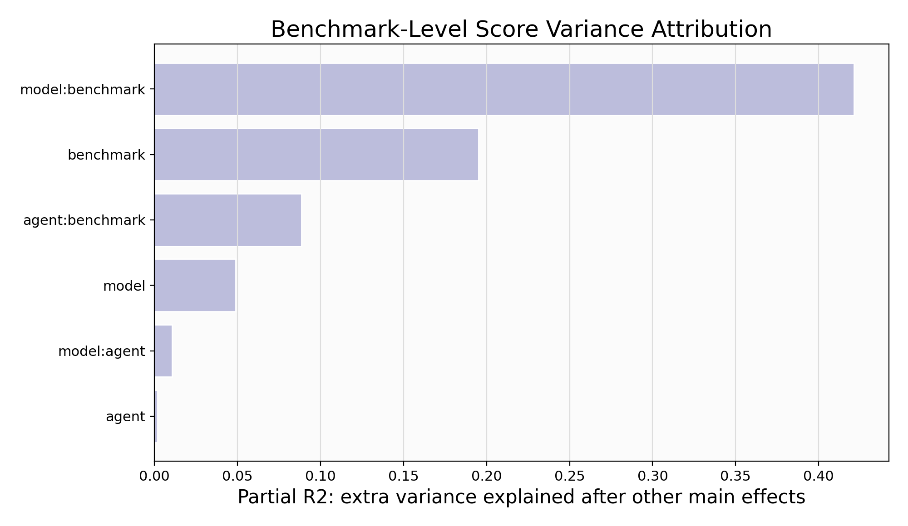

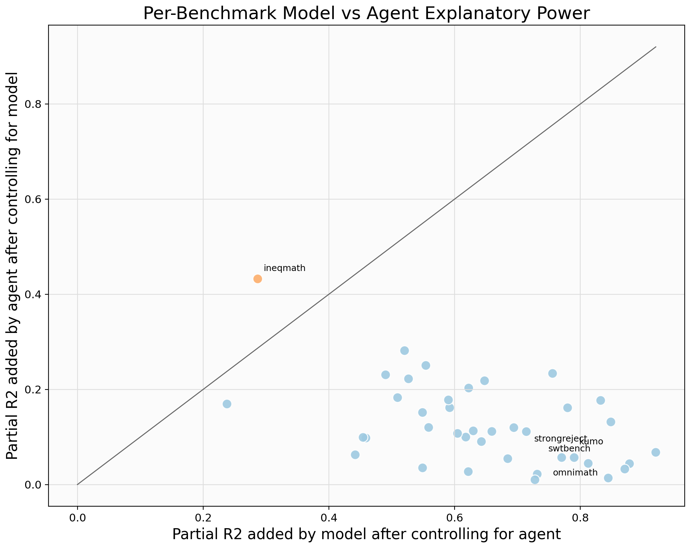

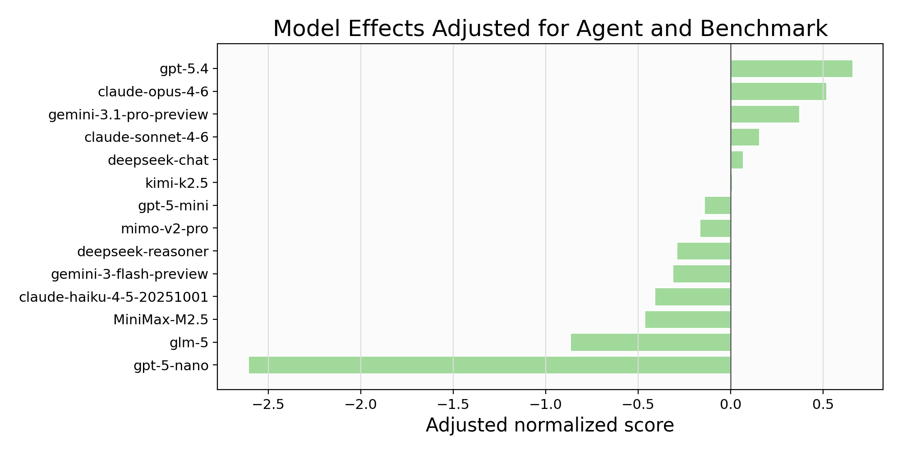

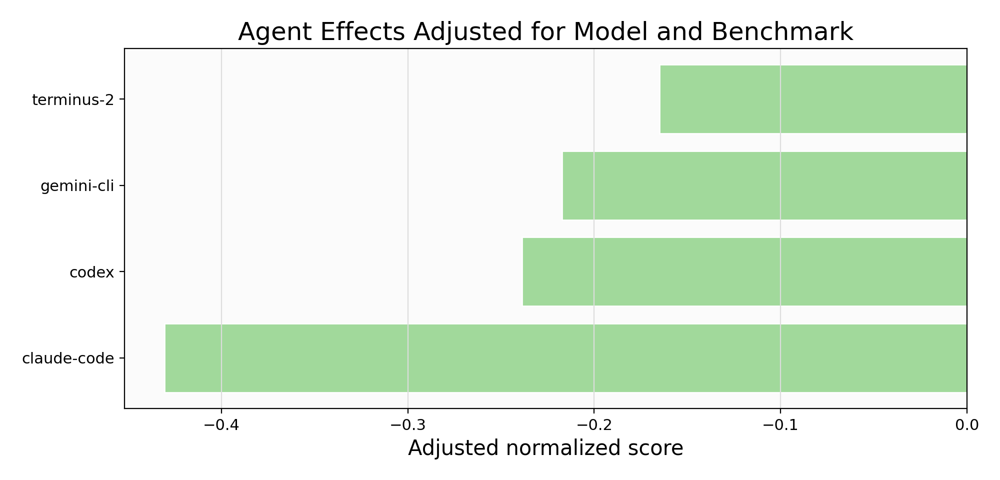

**Result overview and analysis:**
| component | partial_r2_over_other_main_effects | r2 | type |
| --- | --- | --- | --- |
| model:benchmark | 0.421 | 0.673 | interaction_increment |
| all_main_effects | 0.251 | 0.251 | combined |
| benchmark | 0.195 | 0.195 | main_effect |
| agent:benchmark | 0.088 | 0.340 | interaction_increment |
| model | 0.049 | 0.054 | main_effect |
| model:agent | 0.011 | 0.262 | interaction_increment |
| agent | 0.002 | 0.008 | main_effect |

Benchmarks with the largest model-vs-agent role imbalance:
| benchmark | model_partial_r2_over_agent | agent_partial_r2_over_model | dominant_dimension |
| --- | --- | --- | --- |
| kumo | 0.920 | 0.068 | model |
| swtbench | 0.871 | 0.033 | model |
| omnimath | 0.878 | 0.044 | model |
| sldbench | 0.845 | 0.014 | model |
| aider-polyglot | 0.813 | 0.044 | model |
| qcircuitbench | 0.790 | 0.057 | model |
| swe-lancer | 0.728 | 0.010 | model |
| strongreject | 0.849 | 0.132 | model |
| swesmith | 0.770 | 0.057 | model |
| bfcl | 0.732 | 0.022 | model |

**Insight and findings:** Model identity explains much more overall variation than agent identity, but the role varies by benchmark. Agent effects are more useful as benchmark-specific harnessing effects than as a universal main effect.

## Study 3: Agent+Model Leaderboards

**Method:** I keep `agent+model` rankings as descriptive mini-leaderboards. Benchmarks are clustered by score-profile similarity, then each cluster gets a small-multiple leaderboard figure so similar benchmarks can be read together.

**Code files:**
- `src/habor_mix_analyzer/pipeline.py`

**Result paths:**
- `output/paper/tables/benchmark_agent_model_scores.csv`
- `output/paper/tables/benchmark_mini_leaderboards.csv`
- `output/paper/tables/benchmark_similarity_clusters.csv`
- `output/paper/figures/mini_leaderboards_cluster_*.png`

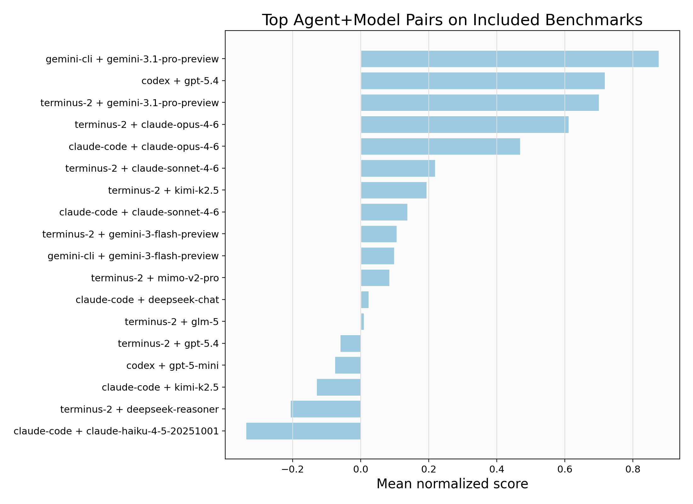

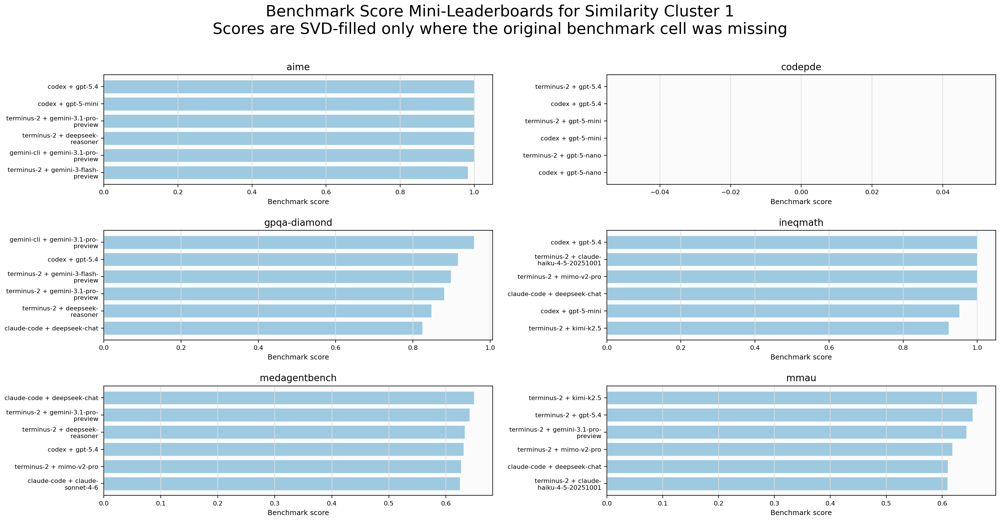
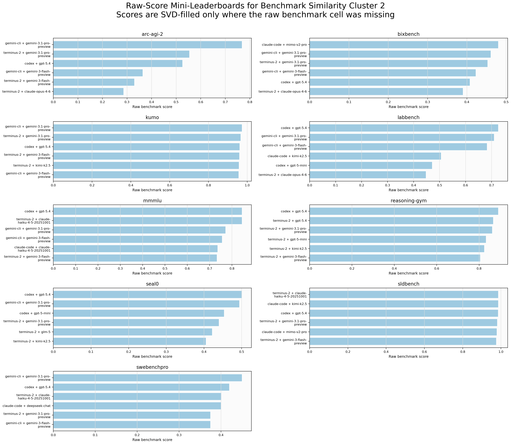
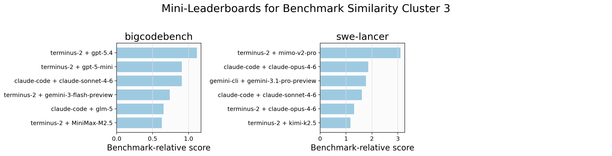
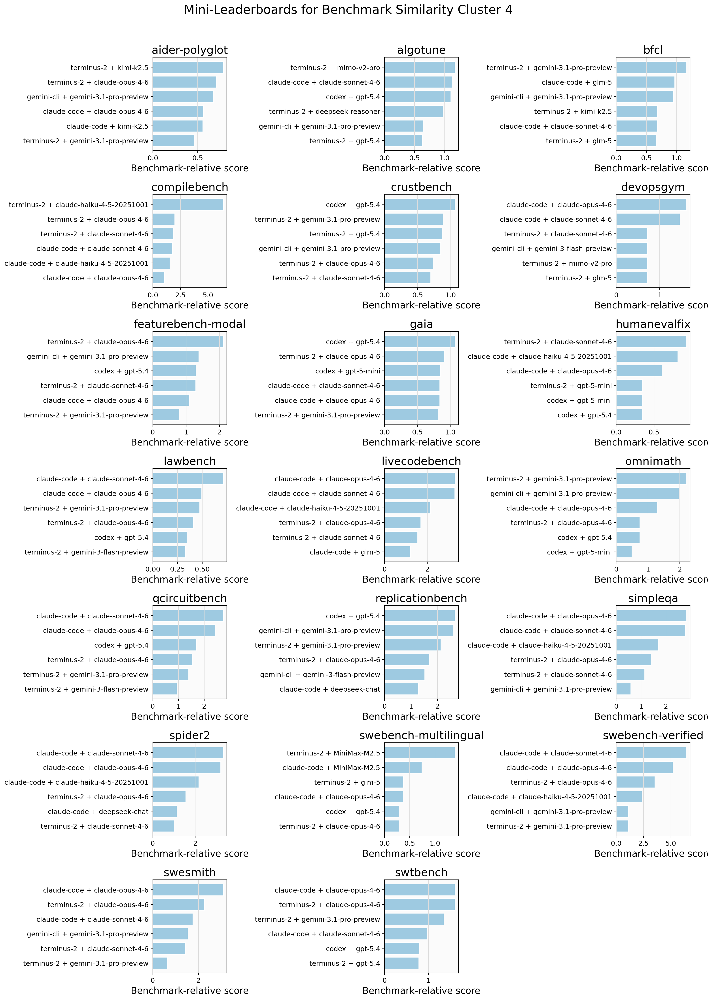
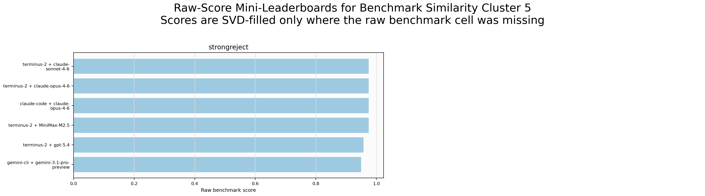
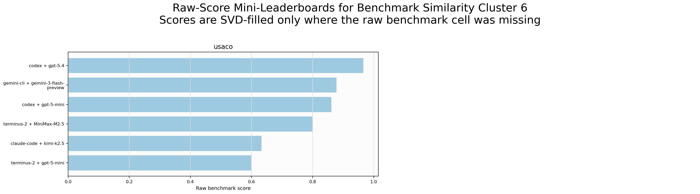

**Result overview and analysis:**
| rank | agent_model | mean_benchmark_relative_score | observed_fraction_on_included_benchmarks |
| --- | --- | --- | --- |
| 1 | gemini-cli + gemini-3.1-pro-preview | 0.877 | 0.949 |
| 2 | codex + gpt-5.4 | 0.718 | 1.000 |
| 3 | terminus-2 + gemini-3.1-pro-preview | 0.701 | 0.974 |
| 4 | terminus-2 + claude-opus-4-6 | 0.612 | 0.333 |
| 5 | claude-code + claude-opus-4-6 | 0.469 | 0.308 |
| 6 | terminus-2 + claude-sonnet-4-6 | 0.219 | 0.333 |
| 7 | terminus-2 + kimi-k2.5 | 0.194 | 0.949 |
| 8 | claude-code + claude-sonnet-4-6 | 0.138 | 0.308 |
| 9 | terminus-2 + gemini-3-flash-preview | 0.107 | 0.949 |
| 10 | gemini-cli + gemini-3-flash-preview | 0.099 | 0.974 |

**Insight and findings:** The leaderboard is useful descriptively, but not sufficient for causal agent claims because model and agent are entangled in the row identity.

## Study 4: Benchmark Predictability and Similarity

**Method:** Following the BenchPress idea, each included benchmark is predicted from the other included benchmarks using ridge regression with cross-validation over agent+model rows. Low or negative R2 means the benchmark is hard to reconstruct from the rest and likely contributes distinct information. Benchmark similarity uses Spearman correlation of agent+model score profiles and hierarchical clustering.

**Code files:**
- `src/habor_mix_analyzer/pipeline.py`

**Result paths:**
- `output/paper/tables/benchmark_uniqueness_filtered.csv`
- `output/paper/tables/benchmark_redundancy_pairs_filtered.csv`
- `output/paper/tables/benchmark_correlation_clustered.csv`

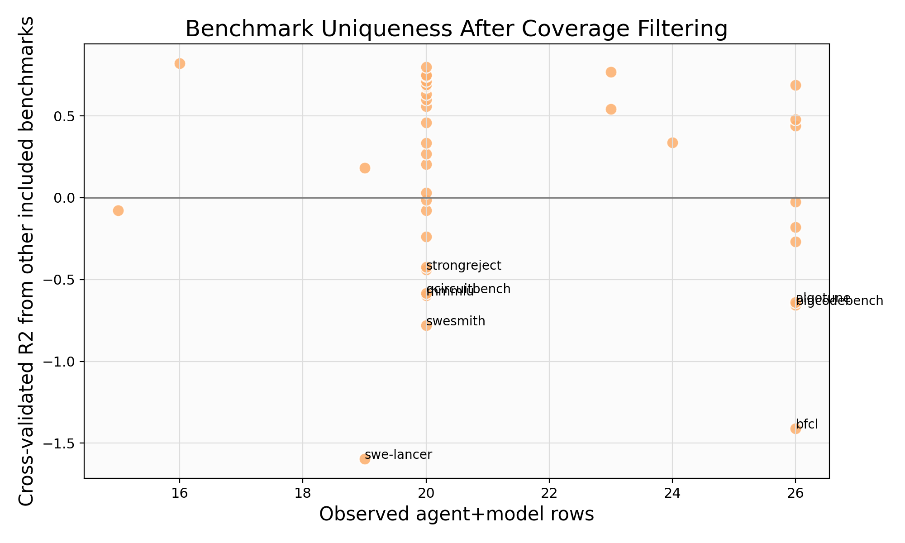

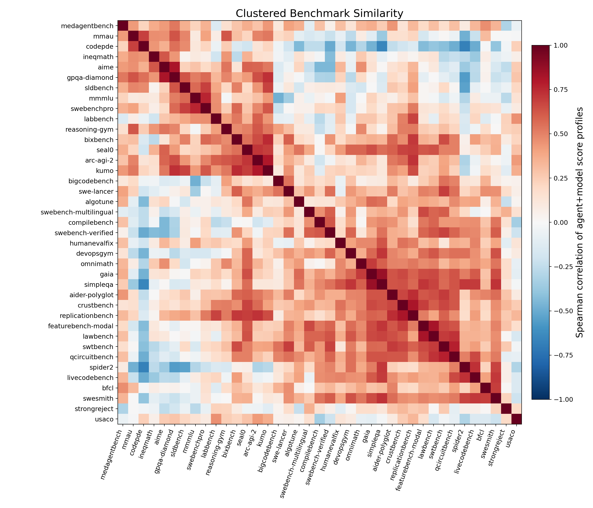

**Result overview and analysis:**
Hardest-to-predict benchmarks:
| benchmark | cv_r2_from_other_included_benchmarks | cv_rmse |
| --- | --- | --- |
| swe-lancer | -1.595 | 2.135 |
| bfcl | -1.411 | 1.180 |
| swesmith | -0.779 | 1.613 |
| bigcodebench | -0.655 | 1.043 |
| algotune | -0.640 | 0.834 |
| mmmlu | -0.597 | 1.508 |
| qcircuitbench | -0.583 | 1.515 |
| strongreject | -0.440 | 1.971 |
| humanevalfix | -0.424 | 14.996 |
| aider-polyglot | -0.268 | 0.858 |

Most similar benchmark pairs:
| left | right | spearman |
| --- | --- | --- |
| gaia | simpleqa | 0.861 |
| featurebench-modal | lawbench | 0.828 |
| aime | gpqa-diamond | 0.816 |
| crustbench | replicationbench | 0.815 |
| arc-agi-2 | kumo | 0.804 |
| swtbench | qcircuitbench | 0.779 |
| mmmlu | swebenchpro | 0.758 |

**Insight and findings:** Predictable benchmarks are candidates for compression; hard-to-predict benchmarks should be preserved when the goal is behavioral breadth. Similarity clusters are also the basis for the grouped mini-leaderboards.

## Study 5: Task Similarity, Predictability, and Representatives

**Method:** Task-level analysis uses reliable, bounded, non-degenerate tasks only. A task is hard to predict when its maximum absolute Spearman correlation to peer tasks in the same benchmark is low. A representative task is one whose score profile correlates strongly with the benchmark's reliable-task aggregate. Within- and cross-benchmark task similarity use median absolute task-profile correlations.

**Code files:**
- `src/habor_mix_analyzer/pipeline.py`

**Result paths:**
- `output/paper/tables/task_predictability_ranked.csv`
- `output/paper/tables/task_representative_tasks.csv`
- `output/paper/tables/task_within_benchmark_similarity.csv`
- `output/paper/tables/task_cross_benchmark_similarity.csv`

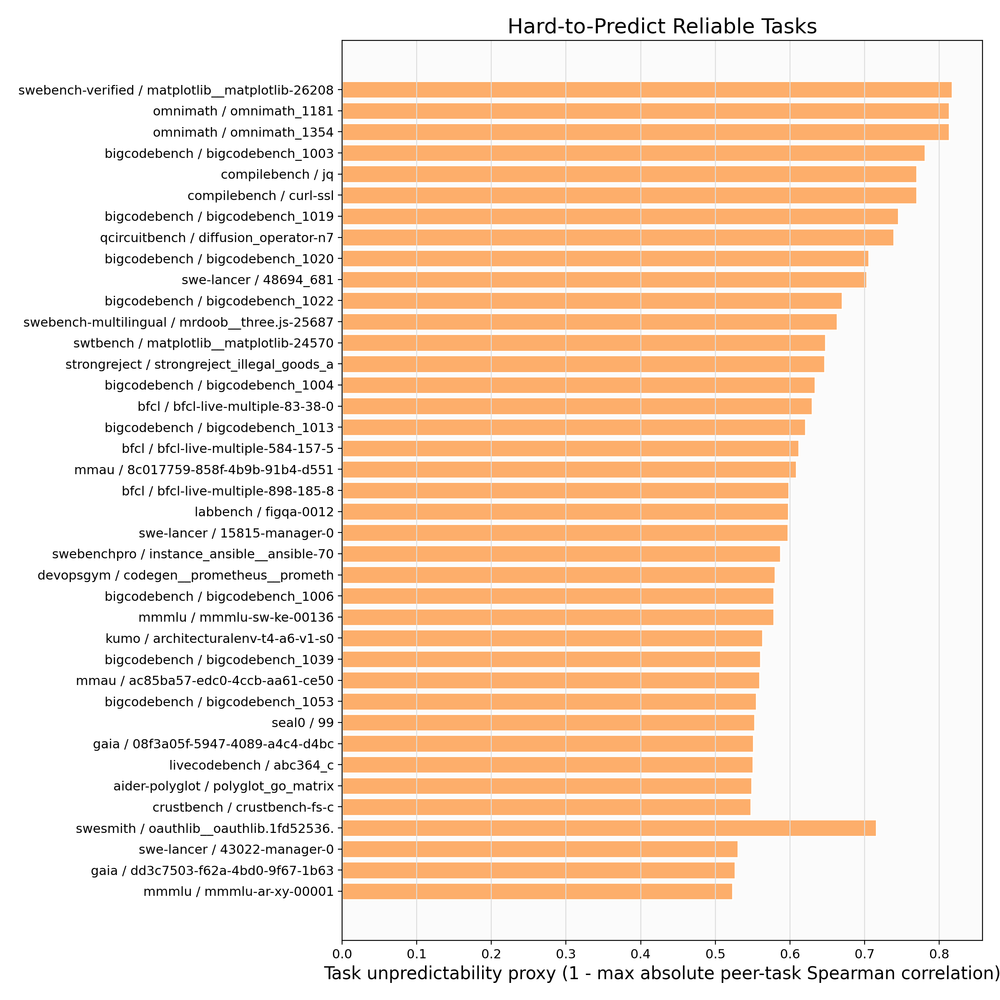

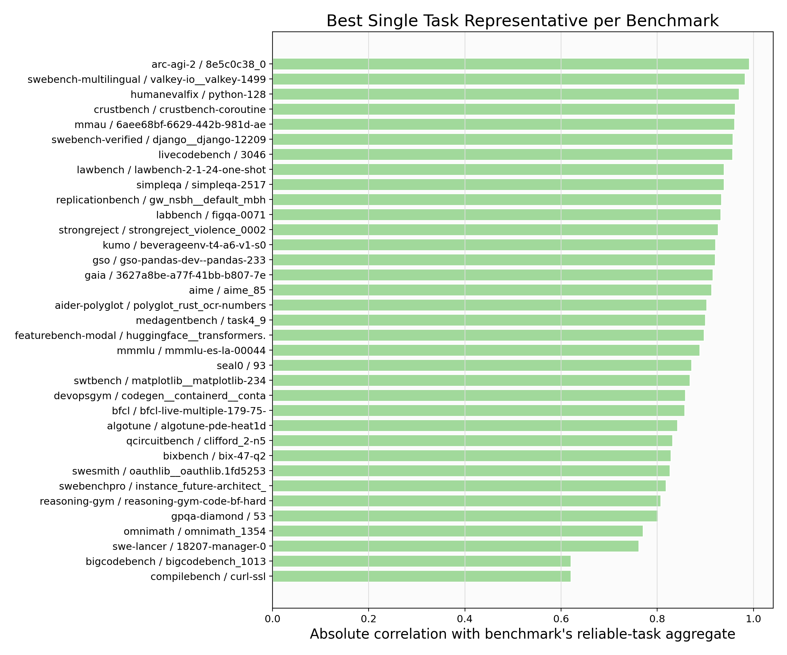

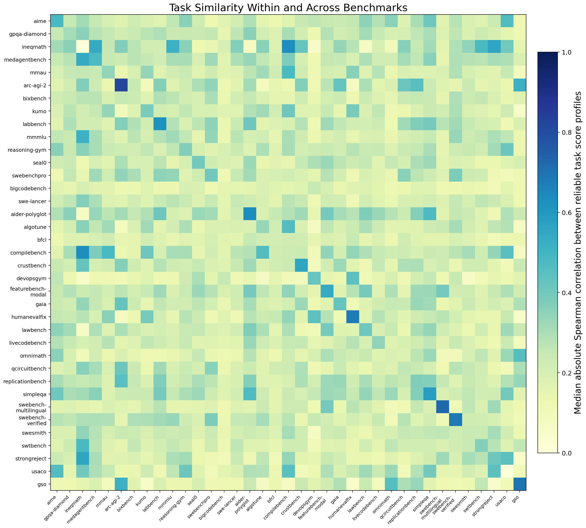

**Result overview and analysis:**
Hardest-to-predict reliable tasks:
| benchmark | task_id | task_unpredictability_score | difficulty_tier | observed_mean |
| --- | --- | --- | --- | --- |
| swebench-verified | matplotlib__matplotlib-26208 | 0.817 | frontier | 0.030 |
| omnimath | omnimath_1354 | 0.813 | medium | 0.633 |
| omnimath | omnimath_1181 | 0.813 | hard | 0.104 |
| bigcodebench | bigcodebench_1003 | 0.781 | medium | 0.680 |
| compilebench | jq | 0.770 | saturated | 0.970 |
| compilebench | curl-ssl | 0.770 | easy | 0.940 |
| bigcodebench | bigcodebench_1019 | 0.745 | hard | 0.064 |
| qcircuitbench | diffusion_operator-n7 | 0.739 | easy | 0.710 |
| swesmith | oauthlib__oauthlib.1fd52536.combine_file__5wgd819s | 0.715 | medium | 0.403 |
| bigcodebench | bigcodebench_1020 | 0.705 | easy | 0.939 |
| swe-lancer | 48694_681 | 0.703 | frontier | 0.024 |
| bigcodebench | bigcodebench_1022 | 0.670 | hard | 0.299 |

Most representative tasks:
| benchmark | task_id | representativeness_score | difficulty_tier | observed_mean |
| --- | --- | --- | --- | --- |
| arc-agi-2 | 8e5c0c38_0 | 0.991 | hard | 0.150 |
| swebench-multilingual | valkey-io__valkey-1499 | 0.983 | medium | 0.673 |
| swebench-multilingual | fmtlib__fmt-3750 | 0.982 | medium | 0.667 |
| swebench-multilingual | briannesbitt__carbon-2752 | 0.982 | medium | 0.667 |
| swebench-multilingual | briannesbitt__carbon-2981 | 0.982 | medium | 0.667 |
| swebench-multilingual | redis__redis-10095 | 0.982 | medium | 0.692 |
| swebench-multilingual | rubocop__rubocop-13375 | 0.982 | medium | 0.692 |
| swebench-multilingual | tokio-rs__tokio-7139 | 0.982 | medium | 0.692 |
| swebench-multilingual | tokio-rs__tokio-6838 | 0.982 | medium | 0.667 |
| swebench-multilingual | briannesbitt__carbon-3103 | 0.981 | medium | 0.692 |
| swebench-multilingual | fluent__fluentd-3917 | 0.981 | medium | 0.692 |
| swebench-multilingual | caddyserver__caddy-6115 | 0.981 | medium | 0.692 |

Benchmarks with strongest within-benchmark task similarity:
| benchmark | n_reliable_tasks | median_abs_task_similarity_within_benchmark |
| --- | --- | --- |
| arc-agi-2 | 94 | 0.754 |
| swebench-multilingual | 240 | 0.725 |
| gso | 2 | 0.694 |
| swebench-verified | 9 | 0.683 |
| humanevalfix | 19 | 0.677 |
| crustbench | 96 | 0.561 |
| medagentbench | 71 | 0.490 |
| aime | 6 | 0.482 |
| labbench | 180 | 0.447 |
| simpleqa | 200 | 0.433 |

**Insight and findings:** Task predictability and representativeness are different objectives. Representative tasks are good compact proxies for a benchmark; hard-to-predict tasks are better stress tests for broad coverage.

## Study 6: Terminus Harnessing Effects

**Method:** Terminus is treated as the fair baseline across models. For every model with both `terminus-2` and another agent row, I compute paired benchmark-relative score deltas while holding the model fixed.

**Code files:**
- `src/habor_mix_analyzer/pipeline.py`

**Result paths:**
- `output/paper/tables/benchmark_agent_lift_vs_terminus.csv`
- `output/paper/tables/terminus_delta_by_model.csv`
- `output/studies/benchmark_level/benchmark_agent_lift_by_benchmark.csv`

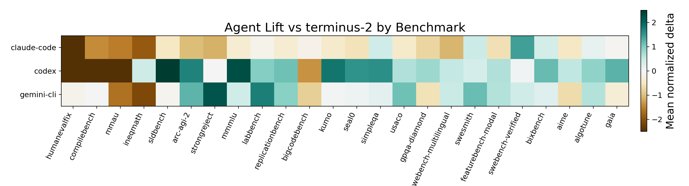

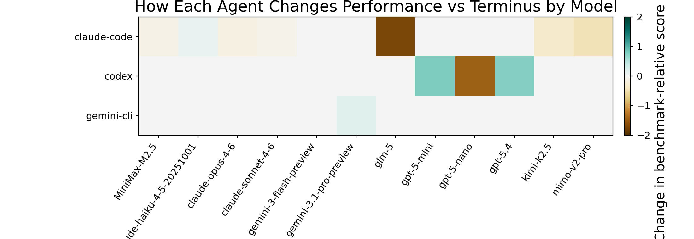

**Result overview and analysis:**
| agent | mean_delta_vs_terminus | win_rate_vs_terminus | compared_models |
| --- | --- | --- | --- |
| gemini-cli | 0.084 | 0.500 | 2 |
| codex | 0.041 | 0.667 | 3 |
| claude-code | -0.392 | 0.399 | 7 |

| model | agent | mean_delta_vs_terminus | win_rate_vs_terminus |
| --- | --- | --- | --- |
| gpt-5-mini | codex | 0.799 | 0.744 |
| gpt-5.4 | codex | 0.779 | 0.744 |
| gemini-3.1-pro-preview | gemini-cli | 0.176 | 0.487 |
| claude-haiku-4-5-20251001 | claude-code | 0.106 | 0.590 |
| gemini-3-flash-preview | gemini-cli | -0.008 | 0.513 |
| claude-sonnet-4-6 | claude-code | -0.081 | 0.436 |
| MiniMax-M2.5 | claude-code | -0.117 | 0.410 |
| claude-opus-4-6 | claude-code | -0.143 | 0.436 |
| kimi-k2.5 | claude-code | -0.325 | 0.282 |
| mimo-v2-pro | claude-code | -0.463 | 0.333 |
| gpt-5-nano | codex | -1.455 | 0.513 |
| glm-5 | claude-code | -1.717 | 0.308 |

**Insight and findings:** Paired deltas are the best current evidence for whether an agent harness improves over Terminus. The deltas vary by model and benchmark, so claims should avoid saying one harness universally dominates.

## Study 7: HaborMix Selection

**Method:** Candidate tasks must be reliable, bounded, discriminative, and non-degenerate. The selection score rewards positive correlation with overall agent+model strength, observed variance, moderate difficulty, and observation count. I cap selection at 6 tasks per benchmark to avoid overrepresenting large benchmarks.

**Code files:**
- `src/habor_mix_analyzer/pipeline.py`

**Result paths:**
- `output/paper/tables/harbormix_candidate_tasks.csv`
- `output/paper/tables/harbormix_selection_by_benchmark.csv`
- `output/studies/task_level/task_frontier_or_saturated_watchlist.csv`

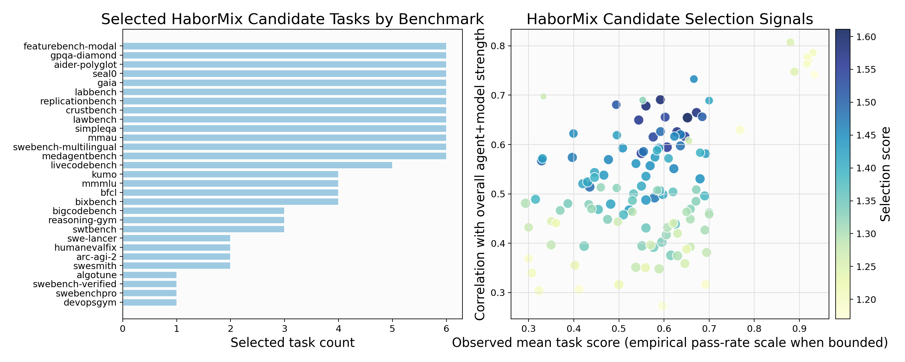

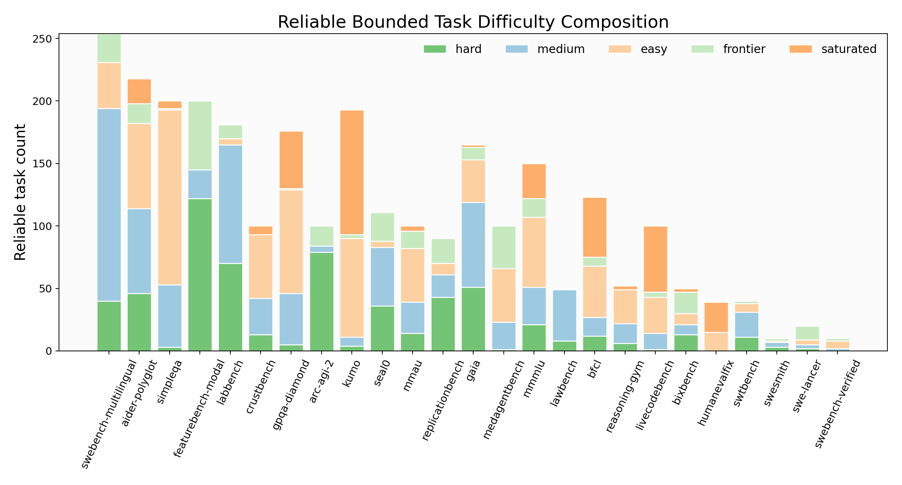

**Result overview and analysis:**
| benchmark | difficulty_tier | selected_tasks | mean_selection_score |
| --- | --- | --- | --- |
| aider-polyglot | medium | 6 | 1.567 |
| featurebench-modal | medium | 6 | 1.543 |
| seal0 | medium | 6 | 1.485 |
| crustbench | medium | 6 | 1.425 |
| labbench | medium | 6 | 1.420 |
| gpqa-diamond | medium | 6 | 1.401 |
| gaia | medium | 6 | 1.391 |
| mmau | medium | 6 | 1.372 |
| swebench-multilingual | medium | 6 | 1.353 |
| simpleqa | medium | 6 | 1.348 |
| lawbench | medium | 6 | 1.335 |
| medagentbench | medium | 6 | 1.265 |
| replicationbench | medium | 5 | 1.348 |
| bixbench | medium | 4 | 1.376 |

- Selected 120 diversified candidate tasks.

**Insight and findings:** HaborMix selection is quantitative and auditable: it balances discriminativeness, difficulty, coverage, and benchmark diversity rather than taking the largest benchmarks wholesale.

## Study 8: Task Aggregate vs Benchmark-Level Score Alignment

**Method:** For each benchmark, I average benchmark-relative task scores and correlate that aggregate with the benchmark-level benchmark-relative score across agent+model rows.

**Code files:**
- `src/habor_mix_analyzer/pipeline.py`

**Result paths:**
- `output/paper/tables/task_to_benchmark_alignment.csv`

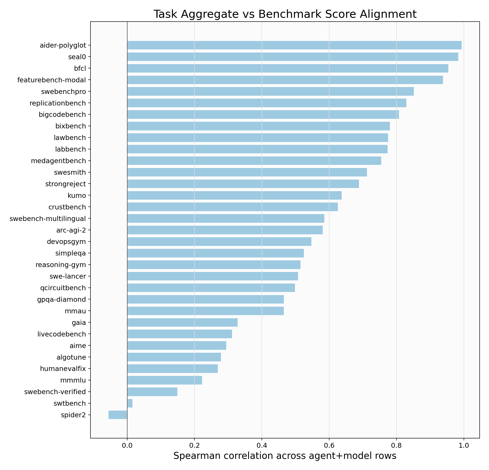

**Result overview and analysis:**
| benchmark | n_reliable_bounded_tasks | spearman_agent_model_correlation |
| --- | --- | --- |
| aider-polyglot | 218 | 0.995 |
| seal0 | 111 | 0.984 |
| bfcl | 123 | 0.955 |
| featurebench-modal | 200 | 0.939 |
| swebenchpro | 8 | 0.852 |
| replicationbench | 90 | 0.830 |
| bigcodebench | 15 | 0.808 |
| bixbench | 50 | 0.781 |
| lawbench | 50 | 0.776 |
| labbench | 181 | 0.774 |
| medagentbench | 100 | 0.755 |
| swesmith | 10 | 0.713 |

**Insight and findings:** Strong alignment means the task matrix explains the benchmark-level score; weak alignment flags benchmarks whose aggregation rule or metric scale needs closer inspection.

## Cross-Study Story

The emerging story is that benchmark diversity matters more than a single aggregate leaderboard. Coverage filtering removes sparse columns from the main benchmark-level claims. Within the retained benchmarks, model identity is usually more explanatory than agent identity, but agent effects vary sharply by model and benchmark. BenchPress-style predictability analysis finds benchmarks that are redundant enough to compress and benchmarks that add distinct signal. The task-level layer then answers a different question: which items are representative, which are hard to predict, and which form a balanced HaborMix candidate set. Terminus paired deltas are the fairest current way to talk about harness improvement.

## Not Completed Yet

- Trial reliability, pass@k, efficiency curves, token/tool cost analysis, and trajectory failure taxonomy still require per-trial run records.
- Full IRT/DIF still requires repeated binary/calibrated task outcomes or enough dense task observations to fit stable item-response models.
- Provider scaling analysis still requires external model metadata such as provider family, parameter scale, release date, and inference budget.
